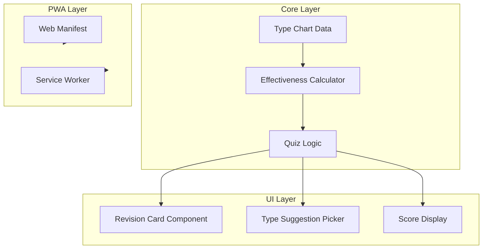

# Pokemon Type Revision Cards PWA

## Architecture Overview



## Tech Stack

- **Build**: Vite + TypeScript
- **UI**: React + Tailwind CSS
- **Testing**: Vitest (unit tests for core)
- **PWA**: Manual manifest + lightweight service worker (no third-party PWA plugin)

## 1. Project Setup

- Initialize Vite React TypeScript project
- Add dependencies: `tailwindcss`, `vite-plugin-pwa`, `vitest`, `@testing-library/react`
- Configure PWA manifest (name, icons, theme colour, display: standalone)

## 2. Core Layer (Heavily Unit Tested)

**Location**: `src/core/`

### 2.1 Type Chart Loader

- Load and validate [pokemon_type_chart.json](pokemon_type_chart.json) (already exists)
- Export typed constants for all 18 types
- Types: `weak_to`, `resists`, `immune_to` per type

### 2.2 Effectiveness Calculator

- **getEffectiveness(attackingType, defendingTypes: [Type] | [Type, Type])**  
  Returns multiplier: `0 | 0.25 | 0.5 | 1 | 2 | 4`
- Dual-type logic: multiply individual effectiveness (e.g. Fire vs Grass/Steel = 2 × 0.5 = 1)
- **getWeaknesses(defendingTypes)** → types that deal 2x or 4x
- **getResistances(defendingTypes)** → types that deal 0.5x or 0.25x
- **getImmunities(defendingTypes)** → types that deal 0x

### 2.3 Quiz Logic

- **generateQuestion()** → random single or dual type combination
- **generateOptions(targetTypes, count)** → mix of correct weak/resist/immune + distractors
- **checkAnswer(question, selectedTypes, category)** → boolean (e.g. "pick weaknesses")
- **getScore(questions, correctCount)** → score calculation

**Unit tests** (Vitest):

- Effectiveness for all single types (spot-check key matchups)
- Dual-type combinations: Fire/Flying (weak to Rock 4x), Grass/Poison (weak to Fire 2x, Psychic 2x), etc.
- Edge cases: immunities (Ghost vs Normal), double resist (0.25x)
- Quiz logic: option generation, answer validation

## 3. Type Metadata (Colours and Images)

**Location**: `src/data/typeMetadata.ts`

- Colour palette per type (e.g. Fire: `#F08030`, Water: `#6890F0`) — use official Pokemon type colours
- Image/icon: use SVG icons or a CDN (e.g. [Pokemon type icons](https://github.com/msikma/pokesprite)) — or simple coloured badges if external assets are avoided
- Export `getTypeColor(type)`, `getTypeIcon(type)`

## 4. UI Components

**Location**: `src/components/`

### 4.1 Revision Card

- Displays target type(s) with colours and icons
- Question text: "Select types that are **super effective** against:" (or "resistant to", "immune to")
- Grid of type buttons (from `generateOptions`)
- User selects one or more, then submits
- Feedback: correct/incorrect highlight, brief explanation

### 4.2 Score Display

- Running score: correct / total
- Optional: streak counter

### 4.3 Flow

- Start screen → "New Quiz" or "Continue"
- Card sequence: show question → user picks → show result → next
- End screen: final score, option to restart

## 5. PWA Configuration

- **Manifest**: `name`, `short_name`, `theme_color`, `background_color`, `display: "standalone"`
- **Icons**: 192x192, 512x512 (generate from a simple type-chart icon)
- **Service worker**: Cache static assets and JSON; offline fallback
- Implement a small custom service worker (no external PWA plugin) so dependencies stay minimal and security surface area is reduced.

## 6. File Structure

```
src/
├── core/
│   ├── typeChart.ts          # Load chart, types
│   ├── effectiveness.ts      # Multiplier + weak/resist/immune
│   ├── quiz.ts               # Question gen, validation, scoring
│   └── __tests__/
│       ├── effectiveness.test.ts
│       └── quiz.test.ts
├── data/
│   └── typeMetadata.ts       # Colours, icons
├── components/
│   ├── RevisionCard.tsx
│   ├── TypeButton.tsx
│   ├── ScoreDisplay.tsx
│   └── QuizFlow.tsx
├── App.tsx
├── main.tsx
└── index.css
```

## 7. Dual-Type Effectiveness Reference

For implementation correctness:

| Scenario                         | Result             |
| -------------------------------- | ------------------ |
| Both weak (2x × 2x)              | 4x super effective |
| One weak, one resist (2x × 0.5x) | 1x normal          |
| One weak, one immune (2x × 0)    | 0x                 |
| Both resist (0.5x × 0.5x)        | 0.25x              |
| One resist, one immune           | 0x                 |

## 8. Quiz Modes (Optional Enhancement)

- **Weaknesses only**: "Pick types super effective against X"
- **Resistances only**: "Pick types not very effective against X"
- **Mixed**: Random category per card

---

## Implementation Order

1. Project setup (Vite, deps, Tailwind, PWA plugin)
2. Core: type chart loader + effectiveness calculator + tests
3. Core: quiz logic + tests
4. Type metadata (colours, icons)
5. UI: TypeButton, RevisionCard, ScoreDisplay, QuizFlow
6. PWA manifest and icons
7. Polish: responsive layout, animations, accessibility
